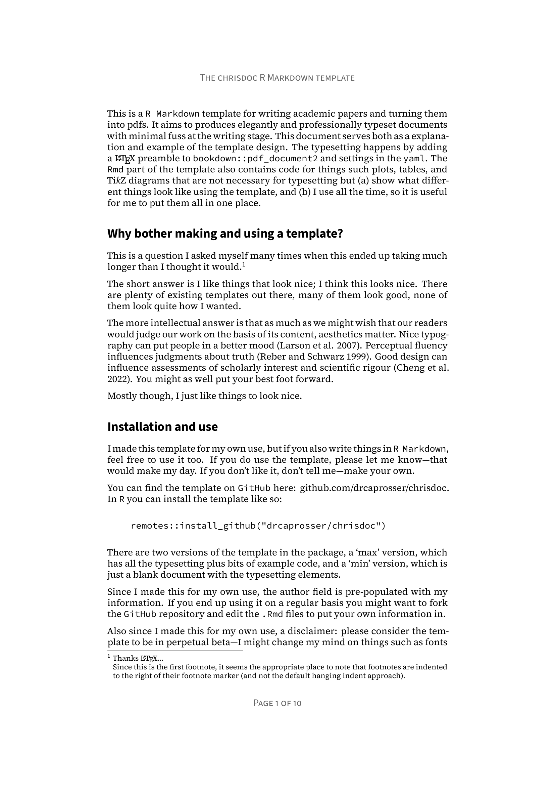

<!-- README.md is generated from README.Rmd. Please edit that file -->

```{r, include = FALSE}
knitr::opts_chunk$set(
  collapse = TRUE,
  comment = "#>",
  fig.path = "man/figures/README-",
  out.width = "100%"
)
```

# chrisdoc

This is a `R Markdown` template for writing academic papers and turning them into pdfs. It aims to produces elegantly and professionally typeset documents with minimal fuss at the writing stage.

<p align="center">
  <a href="man/figures/template_title.png">
    
  </a>
  <a href="man/figures/template_body.png">
    
  </a>
</p>
<p align="center">
  <a href="man/figures/template_figures.png">
    
  </a>
  <a href="man/figures/template_tables.png">
    
  </a>
</p>

You can see more detail about the template design in the example document [here](inst/examples/chrisdoc_example.pdf?raw=1).

## Installation

You can install the `chrisdoc` like so:

``` r
remotes::install_github("drcaprosser/chrisdoc")
```
