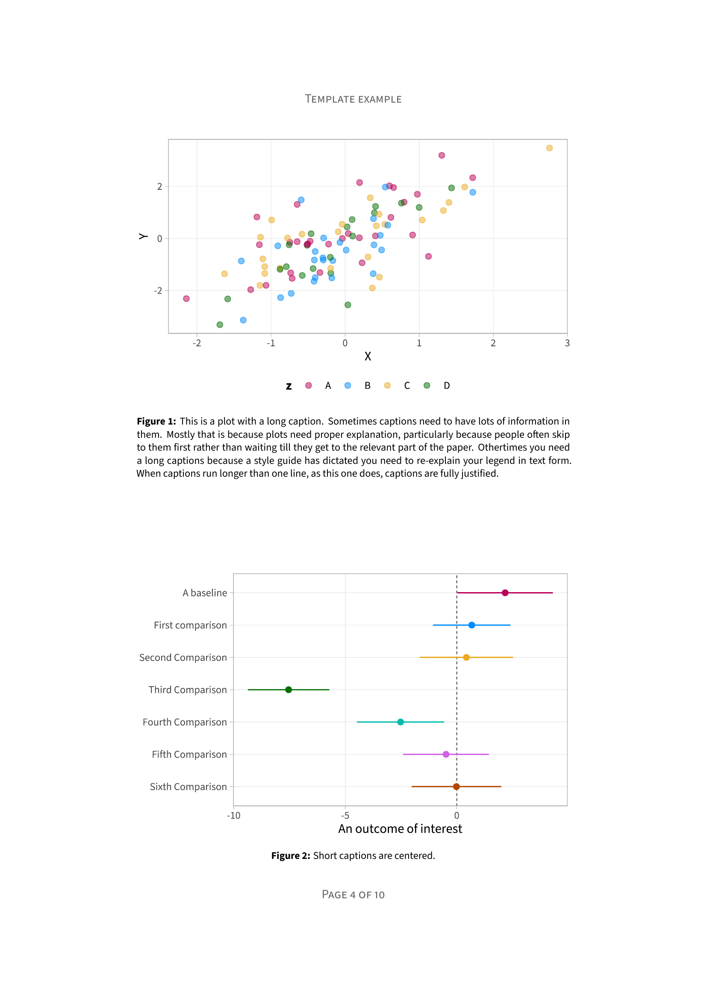

<!-- README.md is generated from README.Rmd. Please edit that file -->

# chrisdoc

This is a `R Markdown` template for writing academic papers and turning
them into pdfs. It aims to produces elegantly and professionally typeset
documents with minimal fuss at the writing stage.





You can see more detail about the template design in the example
document [here](inst/examples/chrisdoc_example.pdf?raw=1).

## Installation

You can install the `chrisdoc` like so:

``` r
remotes::install_github("drcaprosser/chrisdoc")
```
